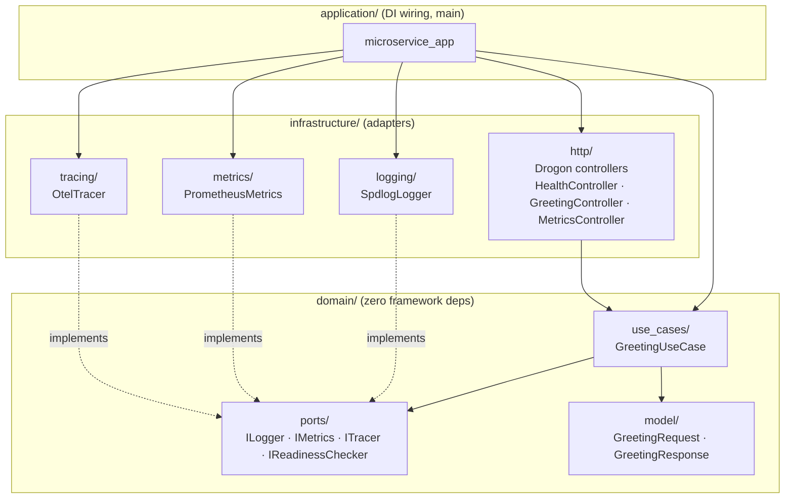

# cpp-rest-microservice-template

A production-grade C++ REST microservice scaffold demonstrating hexagonal architecture, structured logging, distributed tracing, Prometheus metrics, and a full CI quality-gate pipeline.

[](https://github.com/vlantonov/cpp-rest-microservice-template/actions/workflows/build.yml)
[](https://github.com/vlantonov/cpp-rest-microservice-template/actions/workflows/sanitizers.yml)
[](https://github.com/vlantonov/cpp-rest-microservice-template/actions/workflows/coverage.yml)

---

## Overview

This scaffold provides an HTTP REST gateway (Drogon), structured JSON logging (spdlog), OpenTelemetry traces (OTLP HTTP), and Prometheus metrics out of the box. The codebase follows hexagonal (ports-and-adapters) architecture so the domain layer has zero framework dependencies and all infrastructure concerns are swappable adapters. A multi-stage Dockerfile and Kubernetes manifests are included for containerised deployment.

---

## Architecture

The project uses three layers: `domain/` (pure C++20, no external dependencies), `infrastructure/` (framework adapters), and `application/` (dependency wiring and entry point).



| Layer | May depend on | Must NOT depend on |
|---|---|---|
| `domain/` | C++ stdlib only | Any framework library |
| `infrastructure/` | `domain/`, external libs | Other `infrastructure/` submodules directly |
| `application/` | `domain/`, `infrastructure/` | — |

---

## Tech Stack

| Component | Library | Version | Notes |
|---|---|---|---|
| HTTP server | [Drogon](https://github.com/drogonframework/drogon) | 1.9.5 | async, coroutine-capable |
| Structured logging | [spdlog](https://github.com/gabime/spdlog) | 1.14.1 | JSON sink, NDJSON to stdout |
| Distributed tracing | [opentelemetry-cpp](https://github.com/open-telemetry/opentelemetry-cpp) | 1.16.1 | OTLP HTTP exporter; no-op when endpoint unset |
| Metrics | [prometheus-cpp](https://github.com/jupp0r/prometheus-cpp) | 1.2.4 | core-only; `/metrics` served by Drogon |
| Test framework | [Catch2](https://github.com/catchorg/Catch2) | 3.7.1 | v3 |
| Mocking | [FakeIt](https://github.com/eranpeer/FakeIt) | 2.4.1 | header-only, used for port mocks |

---

## Prerequisites

- CMake 3.21+
- Conan 2 (`pip install "conan>=2,<3"`)
- GCC 13+ **or** Clang 16+
- Ninja
- Python 3.10+
- Docker (optional, for container builds)

---

## Quick Start

```bash
# 1. Clone
git clone https://github.com/vlantonov/cpp-rest-microservice-template.git
cd cpp-rest-microservice-template

# 2. Set up Conan profile
cp profiles/gcc ~/.conan2/profiles/default

# 3. Install dependencies
conan install . --build=missing \
  --profile:host=default --profile:build=default \
  -s:h build_type=Release -s:b build_type=Release

# 4. Configure
cmake --preset release

# 5. Build
cmake --build --preset release --parallel

# 6. Test
ctest --test-dir build/Release -VV

# 7. Run
./build/Release/src/application/microservice_app
```

The server listens on port 8080 by default. Set the `PORT` environment variable to override.

---

## Available CMake Presets

| Preset | Build type | Notes |
|---|---|---|
| `debug` | Debug | Debug symbols, no optimisation |
| `release` | Release | LTO (`CMAKE_INTERPROCEDURAL_OPTIMIZATION=ON`) |
| `coverage` | Debug | `ENABLE_COVERAGE=ON`; uses Debug Conan toolchain |
| `asan` | RelWithDebInfo | `-fsanitize=address -O1 -g` |
| `tsan` | RelWithDebInfo | `-fsanitize=thread -O1 -g` |
| `msan` | RelWithDebInfo | `-fsanitize=memory -O1 -g`; requires instrumented libc++ (see CA-04 in SRS) |
| `ubsan` | RelWithDebInfo | `-fsanitize=undefined -O1 -g` |

---

## API Endpoints

| Method & Path | Success | Error | Description |
|---|---|---|---|
| `GET /api/v1/greet?name=<name>` | 200 `{"message":"Hello, <name>!"}` | 400 `{"error":"..."}` | Returns a personalised greeting |
| `GET /health/live` | 200 `{"status":"UP"}` | — | Liveness probe; always 200 while the process is running |
| `GET /health/ready` | 200 `{"status":"READY"}` | 503 `{"status":"NOT_READY"}` | Readiness probe; reflects adapter health |
| `GET /metrics` | 200 Prometheus text 0.0.4 | — | Exposes request counters, latency histogram, active connections |

All request/response bodies are `application/json`. Unregistered routes return 404; wrong method on a registered route returns 405.

---

## Configuration

All configuration is read from environment variables at startup.

| Environment variable | Default | Description |
|---|---|---|
| `PORT` | `8080` | TCP port the HTTP server listens on |
| `LOG_LEVEL` | `info` | Minimum log level (`trace`, `debug`, `info`, `warn`, `error`, `critical`) |
| `OTEL_EXPORTER_OTLP_ENDPOINT` | _(empty)_ | OTLP HTTP collector URL (e.g. `http://otel-collector:4318`). Unset → no-op tracer |
| `SERVICE_NAME` | `cpp-microservice` | Service name embedded in log records and OTel resource attributes |

---

## Running Tests with Coverage

```bash
# Install Debug dependencies
conan install . --build=missing \
  --profile:host=default --profile:build=default \
  -s:h build_type=Debug -s:b build_type=Debug

# Configure and build with coverage instrumentation
cmake --preset coverage
cmake --build --preset coverage --parallel

# Generate coverage data (produces build/Coverage/cov.info.cleaned)
cmake --build --preset coverage --target cov_data

# Optional: generate HTML report at build/Coverage/cov/
cmake --build --preset coverage --target cov
```

The CI coverage gate enforces a minimum line coverage of **70%**.

---

## Docker

```bash
# Build the image
docker build -t cpp-rest-microservice-template:latest .

# Run
docker run --rm -p 8080:8080 \
  -e LOG_LEVEL=debug \
  cpp-rest-microservice-template:latest
```

The Dockerfile uses a two-stage build: a `ubuntu:24.04` builder stage compiles the binary with Conan and CMake, then a minimal `ubuntu:24.04` runtime stage copies only the stripped binary and required shared libraries (`libstdc++6`, `libssl3`).

---

## Kubernetes

```bash
# Substitute the image tag placeholder and apply
sed 's/IMAGE_TAG/v0.1.0/g' deploy/k8s/manifest.yaml | kubectl apply -f -
```

The manifest creates:

- **Deployment** — 2 replicas, rolling update (max surge 1, max unavailable 0), liveness probe on `GET /health/live`, readiness probe on `GET /health/ready`, Prometheus scrape annotations.
- **Service** — `ClusterIP`, port 80 → container port 8080.

Resource requests: 100m CPU / 64Mi memory. Limits: 500m CPU / 256Mi memory.

---

## CI Pipeline

| Workflow | Trigger | Job(s) | Purpose |
|---|---|---|---|
| `build.yml` | push → `main`/`develop`; PR → `main` | GCC Release, Clang Release | Compile + run tests with both compilers |
| `sanitizers.yml` | PR → `main`; `workflow_dispatch` | ASAN, TSAN, UBSAN (Clang) | Runtime error detection |
| `coverage.yml` | push → `main`; `workflow_dispatch` | GCC Coverage | lcov coverage gate (≥ 70%), publishes HTML artefact |
| `valgrind.yml` | push → `main`; `workflow_dispatch` | GCC Debug | Valgrind memcheck; fails on any reported leak or error |

All workflows cancel in-flight runs for the same branch on a new push.

---

## Extending the Scaffold

- **Add a new use case** — Create a new class under `src/domain/use_cases/`, inject the ports it needs via constructor parameters, register it in `DependencyContainer`.
- **Add a new endpoint** — Add a Drogon `HttpController` under `src/infrastructure/http/`, wire it through `DependencyContainer`, and register the route in `main.cpp`.
- **Add a persistence adapter** — Define a pure-virtual port under `src/domain/ports/`, implement it in a new `src/infrastructure/` subdirectory, and inject it via `DependencyContainer`. The domain layer requires no changes.
- **Enable OTel export** — Set `OTEL_EXPORTER_OTLP_ENDPOINT` to your collector's OTLP HTTP URL. `OtelTracer` switches from the no-op provider to the OTLP HTTP exporter automatically at startup.

---

## License

MIT — see [LICENSE](LICENSE).
