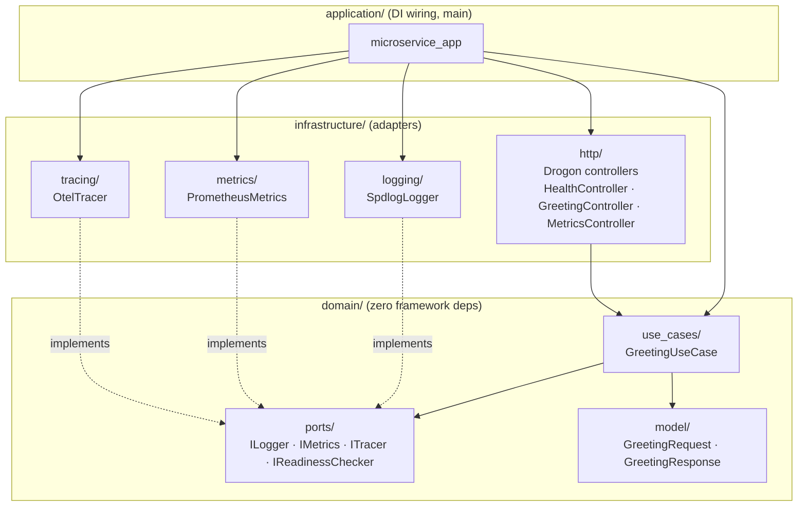
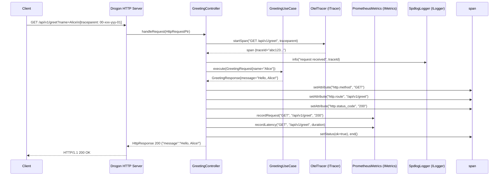

# C++ REST Microservice Template — Design Document

**Project:** cpp-rest-microservice-template  
**Version:** 1.0.0-draft  
**Date:** 2026-08-16  
**Status:** Draft — pending C++ Developer implementation  
**SRS ref:** `docs/requirements/SRS.md` v1.0.0-draft

---

## 1. Architecture Overview

### 1.1 Architectural Pattern

The system implements **Hexagonal Architecture** (ports-and-adapters). Domain logic is isolated at the centre; all external concerns (HTTP, logging, metrics, tracing) attach through pure-virtual port interfaces and are implemented as infrastructure adapters. This satisfies FR-19 – FR-22 and AC-08.

### 1.2 Component Diagram



### 1.3 Layering Rules

| Layer | May depend on | Must NOT depend on |
|---|---|---|
| `domain/` | C++ stdlib only | Any framework library |
| `infrastructure/` | `domain/`, external libs | Other `infrastructure/` submodules (except via domain ports) |
| `application/` | `domain/`, `infrastructure/` | (top of graph — no restriction) |

---

## 2. Directory Tree

```
cpp-rest-microservice-template/
├── CMakeLists.txt              # Root CMake; sets CXX_STANDARD 20, add_subdirectory chain
├── CMakePresets.json           # Defines debug / release / coverage / sanitizer presets
├── conanfile.py                # Conan 2 recipe; pinned deps, CMakeDeps + CMakeToolchain
├── Dockerfile                  # Multi-stage: builder → runtime (ubuntu:24.04)
├── deploy/
│   └── k8s/
│       └── manifest.yaml       # Deployment + Service; IMAGE_TAG placeholder for CI substitution
├── docs/
│   ├── requirements/
│   │   └── SRS.md
│   └── design/
│       └── DESIGN.md           # ← this file
├── src/
│   ├── domain/
│   │   ├── CMakeLists.txt      # microservice_domain STATIC target; zero external deps
│   │   ├── model/
│   │   │   ├── GreetingRequest.hpp    # Value object — validated inbound name
│   │   │   └── GreetingResponse.hpp   # Value object — outbound greeting message
│   │   ├── ports/
│   │   │   ├── ILogger.hpp            # Pure-virtual structured log port
│   │   │   ├── IMetrics.hpp           # Pure-virtual metrics recording port
│   │   │   ├── ITracer.hpp            # Pure-virtual distributed tracing port
│   │   │   └── IReadinessChecker.hpp  # Pure-virtual dependency health port
│   │   └── use_cases/
│   │       ├── GreetingUseCase.hpp    # Application service interface
│   │       └── GreetingUseCase.cpp    # Orchestrates domain logic via injected ports
│   ├── infrastructure/
│   │   ├── CMakeLists.txt      # microservice_infra STATIC target; links all adapters
│   │   ├── http/
│   │   │   ├── GreetingController.hpp  # Drogon HttpController; maps HTTP ↔ use-case
│   │   │   ├── GreetingController.cpp
│   │   │   ├── HealthController.hpp    # Serves /health/live and /health/ready
│   │   │   ├── HealthController.cpp
│   │   │   ├── MetricsController.hpp   # Serves /metrics in Prometheus text format
│   │   │   └── MetricsController.cpp
│   │   ├── logging/
│   │   │   ├── SpdlogLogger.hpp  # ILogger adapter backed by spdlog JSON sink
│   │   │   └── SpdlogLogger.cpp
│   │   ├── metrics/
│   │   │   ├── PrometheusMetrics.hpp  # IMetrics adapter; owns prometheus-cpp Registry
│   │   │   └── PrometheusMetrics.cpp
│   │   └── tracing/
│   │       ├── OtelTracer.hpp   # ITracer adapter; configures OTLP/gRPC or no-op exporter
│   │       └── OtelTracer.cpp
│   └── application/
│       ├── CMakeLists.txt       # microservice_app executable
│       ├── Config.hpp           # Reads env vars: PORT, LOG_LEVEL, OTEL_EXPORTER_OTLP_ENDPOINT
│       ├── DependencyContainer.hpp  # Owns adapter instances; wires ports into use-cases
│       └── main.cpp             # Entry point: build container, register controllers, start Drogon
└── tests/
    ├── CMakeLists.txt           # microservice_tests target; CTest registration
    ├── domain/
    │   └── GreetingUseCaseTest.cpp  # Unit tests via FakeIt mocks of ILogger/IMetrics/ITracer
    ├── infrastructure/
    │   └── SpdlogLoggerTest.cpp     # Adapter construction smoke-test
    └── TestMain.cpp             # Provides Catch2 session entry point
```

---

## 3. Key Interface Definitions

All interfaces live under `src/domain/ports/`. These are **declarations only** — no implementation.

### 3.1 `ILogger`

```cpp
// src/domain/ports/ILogger.hpp
#pragma once
#include <string_view>

namespace domain::ports {

class ILogger {
public:
    enum class Level { Trace, Debug, Info, Warn, Error, Critical };

    virtual ~ILogger() = default;

    virtual void log(Level level,
                     std::string_view message,
                     std::string_view trace_id = "") noexcept = 0;

    void trace(std::string_view msg, std::string_view tid = "") noexcept { log(Level::Trace,    msg, tid); }
    void debug(std::string_view msg, std::string_view tid = "") noexcept { log(Level::Debug,    msg, tid); }
    void info (std::string_view msg, std::string_view tid = "") noexcept { log(Level::Info,     msg, tid); }
    void warn (std::string_view msg, std::string_view tid = "") noexcept { log(Level::Warn,     msg, tid); }
    void error(std::string_view msg, std::string_view tid = "") noexcept { log(Level::Error,    msg, tid); }
};

} // namespace domain::ports
```

### 3.2 `IMetrics`

```cpp
// src/domain/ports/IMetrics.hpp
#pragma once
#include <string_view>
#include <chrono>

namespace domain::ports {

class IMetrics {
public:
    virtual ~IMetrics() = default;

    // Increment request counter; method = "GET"/"POST"/…, status = "200"/"404"/…
    virtual void recordRequest(std::string_view method,
                               std::string_view route,
                               std::string_view status) noexcept = 0;

    // Observe request duration for the latency histogram
    virtual void recordLatency(std::string_view method,
                               std::string_view route,
                               std::chrono::microseconds duration) noexcept = 0;

    // Set current active-connection gauge
    virtual void setActiveConnections(int count) noexcept = 0;

    // Render the Prometheus text exposition (0.0.4) for /metrics
    virtual std::string serialize() const = 0;
};

} // namespace domain::ports
```

### 3.3 `ITracer` and `ISpan`

```cpp
// src/domain/ports/ITracer.hpp
#pragma once
#include <string_view>
#include <memory>

namespace domain::ports {

// Opaque span handle — infrastructure owns the concrete OTel type
class ISpan {
public:
    virtual ~ISpan() = default;
    virtual void setAttribute(std::string_view key, std::string_view value) noexcept = 0;
    virtual void setStatus(bool ok, std::string_view description = "") noexcept = 0;
    virtual std::string traceId() const noexcept = 0;
    virtual void end() noexcept = 0;
};

class ITracer {
public:
    virtual ~ITracer() = default;

    // Extract W3C traceparent from the inbound header; start a child span
    virtual std::unique_ptr<ISpan> startSpan(
        std::string_view operation_name,
        std::string_view traceparent_header = "") noexcept = 0;
};

} // namespace domain::ports
```

### 3.4 `IReadinessChecker`

```cpp
// src/domain/ports/IReadinessChecker.hpp
#pragma once

namespace domain::ports {

class IReadinessChecker {
public:
    virtual ~IReadinessChecker() = default;
    virtual bool isReady() const noexcept = 0;
};

} // namespace domain::ports
```

> **Injection strategy:** `GreetingUseCase` receives `ILogger&`, `IMetrics&`, and `ITracer&` as constructor parameters (non-owning references). `DependencyContainer` owns the concrete adapter instances as data members and passes references into use-cases. This avoids the overhead of `shared_ptr` virtual dispatch on the hot path while keeping the domain fully decoupled (AC-08).

---

## 4. Sequence Diagram — Typical REST Request



**Health check fast-path:** `HealthController` has no dependency on `GreetingUseCase` or `ITracer`. It calls only `IReadinessChecker::isReady()`, guaranteeing probe availability under load (FR-07).

---

## 5. CMake Target Layout

### 5.1 Target Dependency Graph

```
microservice_tests  (executable, registered with CTest)
    │
    ├── PRIVATE  microservice_domain
    ├── PRIVATE  microservice_infra
    ├── PRIVATE  Catch2::Catch2WithMain
    └── PRIVATE  fakeit::fakeit           (header-only INTERFACE target)

microservice_app  (executable)
    │
    ├── PRIVATE  microservice_domain
    └── PRIVATE  microservice_infra

microservice_infra  (STATIC)
    │
    ├── PUBLIC   microservice_domain       ← exposes domain headers transitively
    ├── PRIVATE  drogon::drogon
    ├── PRIVATE  spdlog::spdlog
    ├── PRIVATE  opentelemetry-cpp::opentelemetry_api
    ├── PRIVATE  opentelemetry-cpp::opentelemetry_sdk
    ├── PRIVATE  opentelemetry-cpp::opentelemetry_exporter_otlp_grpc
    └── PRIVATE  prometheus-cpp::core

microservice_domain  (STATIC)
    │
    └── (C++ stdlib only — no external deps)
```

### 5.2 Coverage Targets

| CMake Target | Depends on | Action |
|---|---|---|
| `cov_data` | `microservice_tests` | Run test binary under `--coverage`; `lcov --capture`; filter; write `build/cov.info.cleaned` |
| `cov` | `cov_data` | `genhtml build/cov.info.cleaned --output-directory build/coverage_html` |

`lcov` filter exclusions (applied with `--remove`):
- `/usr/include/**` — system headers
- `${CMAKE_SOURCE_DIR}/tests/**` — test sources themselves
- `*/.conan2/**` — Conan package cache
- `*/catch2/**`, `*/fakeit/**` — vendored test libs

Extra `lcov` flag: `--ignore-errors unused`

### 5.3 CMakePresets.json Configurations

| Preset | Generator | Build type | Extra `CMAKE_CXX_FLAGS` |
|---|---|---|---|
| `debug` | Ninja | Debug | `–DCMAKE_EXPORT_COMPILE_COMMANDS=ON` |
| `release` | Ninja | Release | `–DCMAKE_INTERPROCEDURAL_OPTIMIZATION=ON` |
| `coverage` | Ninja | Debug | `–DENABLE_COVERAGE=ON` → adds `--coverage -O0 -g` |
| `asan` | Ninja | RelWithDebInfo | `-fsanitize=address -O1 -g` |
| `tsan` | Ninja | RelWithDebInfo | `-fsanitize=thread -O1 -g` |
| `msan` | Ninja | RelWithDebInfo | `-fsanitize=memory -O1 -g` |
| `ubsan` | Ninja | RelWithDebInfo | `-fsanitize=undefined -O1 -g` |

---

## 6. Conan 2 Profile & `conanfile.py` Sketch

### 6.1 Default Conan Profile (Linux / GCC)

```ini
[settings]
os=Linux
arch=x86_64
compiler=gcc
compiler.version=12
compiler.libcxx=libstdc++11
compiler.cppstd=20
build_type=Release
```

A second profile `profiles/clang` mirrors the above with `compiler=clang`, `compiler.version=16`, `compiler.libcxx=libstdc++11`.

### 6.2 `conanfile.py` Sketch

```python
from conan import ConanFile
from conan.tools.cmake import CMakeDeps, CMakeToolchain

class MicroserviceTemplate(ConanFile):
    name = "cpp-rest-microservice-template"
    version = "1.0.0"
    settings = "os", "compiler", "build_type", "arch"
    generators = "CMakeDeps", "CMakeToolchain"

    def requirements(self):
        self.requires("drogon/1.9.6")           # MIT
        self.requires("spdlog/1.14.1")           # MIT
        self.requires("opentelemetry-cpp/1.16.1") # Apache-2.0
        self.requires("prometheus-cpp/1.2.4")    # MIT
        self.requires("catch2/3.7.1")            # BSL-1.0
        self.requires("fakeit/2.4.1")            # MIT

    def configure(self):
        # Drogon: disable ORM and data-store adapters not needed in this scaffold
        self.options["drogon"].with_orm        = False
        self.options["drogon"].with_redis      = False
        self.options["drogon"].with_sqlite3    = False
        self.options["drogon"].with_postgresql = False
        self.options["drogon"].with_mysql      = False

        # opentelemetry-cpp: enable only the OTLP/gRPC exporter
        self.options["opentelemetry-cpp"].with_otlp_grpc = True
        self.options["opentelemetry-cpp"].with_otlp_http = False

        # prometheus-cpp: link core only; MetricsController serves the text via Drogon
        # (avoids port conflict between prometheus-cpp's built-in HTTP server and Drogon)
        self.options["prometheus-cpp"].with_pull = False
        self.options["prometheus-cpp"].with_push = False
```

### 6.3 Dependency License Summary

| Package | ConanCenter ID | License | Notes |
|---|---|---|---|
| Drogon | `drogon/1.9.6` | MIT | Pulls trantor, jsoncpp transitively |
| spdlog | `spdlog/1.14.1` | MIT | Compiled mode preferred for faster builds |
| opentelemetry-cpp | `opentelemetry-cpp/1.16.1` | Apache-2.0 | Pulls grpc + protobuf; cache Conan pkgs in CI |
| prometheus-cpp | `prometheus-cpp/1.2.4` | MIT | `core` only (see OQ-01) |
| Catch2 | `catch2/3.7.1` | BSL-1.0 | Use `Catch2::Catch2WithMain` CMake target |
| FakeIt | `fakeit/2.4.1` | MIT | Header-only; include `catch2/fakeit.hpp` |

---

## 7. Docker Multi-Stage Design

```
┌─────────────────────────────────────────────────────────────┐
│  Stage 1 — builder  (ubuntu:24.04)                          │
│                                                             │
│  apt-get: cmake ninja-build gcc g++ python3-pip git curl    │
│  pip: conan==2.*                                            │
│                                                             │
│  COPY . /src                                                │
│  WORKDIR /src                                               │
│  RUN conan install . --output-folder=build \               │
│          --build=missing -s build_type=Release              │
│  RUN cmake --preset release -B build                        │
│  RUN cmake --build build --target microservice_app -j$(nproc) │
└───────────────────────┬─────────────────────────────────────┘
                        │  COPY --from=builder
┌───────────────────────▼─────────────────────────────────────┐
│  Stage 2 — runtime  (ubuntu:24.04)                          │
│                                                             │
│  apt-get --no-install-recommends:                           │
│    libstdc++6  libssl3  ca-certificates                     │
│                                                             │
│  COPY --from=builder /src/build/microservice_app            │
│       /usr/local/bin/microservice_app                       │
│                                                             │
│  EXPOSE 8080                                                │
│  ENV    LOG_LEVEL=info                                      │
│  ENTRYPOINT ["/usr/local/bin/microservice_app"]             │
└─────────────────────────────────────────────────────────────┘
```

**Design decisions:**
- `ubuntu:24.04` in both stages matches the CI runner OS, eliminating glibc version mismatches (NFR-03).
- Dependencies are statically linked where possible (spdlog, prometheus-cpp core, Catch2). If Drogon or opentelemetry-cpp produce `.so` files, they are copied from the builder stage via an explicit `COPY --from=builder` rather than re-installing in runtime, keeping compiler tooling out of the final image (FR-33).
- The binary is stripped (`cmake --build … -- VERBOSE=1` + `strip`) to reduce image size toward the ≤ 150 MB target (NFR-08).

---

## 8. Kubernetes Resource Design

Single file: `deploy/k8s/manifest.yaml` (Deployment and Service separated by `---`).

### 8.1 Deployment

```yaml
apiVersion: apps/v1
kind: Deployment
metadata:
  name: microservice-template
  labels:
    app: microservice-template
spec:
  replicas: 2
  strategy:
    type: RollingUpdate
    rollingUpdate:
      maxSurge: 1
      maxUnavailable: 0
  selector:
    matchLabels:
      app: microservice-template
  template:
    metadata:
      labels:
        app: microservice-template
      annotations:
        prometheus.io/scrape: "true"
        prometheus.io/port: "8080"
        prometheus.io/path: "/metrics"
    spec:
      containers:
        - name: microservice-template
          image: ghcr.io/<owner>/cpp-rest-microservice-template:IMAGE_TAG
          ports:
            - containerPort: 8080
          env:
            - name: LOG_LEVEL
              value: "info"
          resources:
            requests:
              cpu: "100m"
              memory: "64Mi"
            limits:
              cpu: "500m"
              memory: "256Mi"
          livenessProbe:
            httpGet:
              path: /health/live
              port: 8080
            initialDelaySeconds: 5
            periodSeconds: 10
            failureThreshold: 3
          readinessProbe:
            httpGet:
              path: /health/ready
              port: 8080
            initialDelaySeconds: 3
            periodSeconds: 5
            failureThreshold: 3
```

### 8.2 Service

```yaml
---
apiVersion: v1
kind: Service
metadata:
  name: microservice-template
spec:
  type: ClusterIP
  selector:
    app: microservice-template
  ports:
    - name: http
      port: 80
      targetPort: 8080
      protocol: TCP
```

`IMAGE_TAG` is substituted in CI before `kubectl apply` via:

```bash
sed -i "s/IMAGE_TAG/${GITHUB_SHA}/g" deploy/k8s/manifest.yaml
```

---

## 9. CI Job Topology

### 9.1 Triggers

```yaml
on:
  push:
    branches: [main, develop]
  pull_request:
    branches: [main]
```

### 9.2 Job Dependency Graph

```
  ┌──────────────┐      ┌───────────────┐
  │  build-gcc   │      │  build-clang  │
  │  (Release)   │      │  (Release)    │
  └──────┬───────┘      └───────────────┘
         │ needs: —              │ needs: —
         │ upload-artifact@v7    │ (independent)
         ▼
  ┌──────────────────────────────────────────────┐
  │  test-artifact  (upload binary via v7)        │
  └──────┬───────────────────────────────────────┘
         │ download-artifact@v8
  ┌──────┴──────────────────────────────┐
  │                                     │
  ▼         ▼           ▼         ▼     ▼
┌──────┐ ┌──────┐ ┌──────────┐ ┌──────┐│
│ asan │ │ tsan │ │  ubsan   │ │ msan ││  (each: rebuild with sanitizer preset)
└──────┘ └──────┘ └──────────┘ └──────┘│
                                        │
  ┌─────────────────────────────────────┘
  │
  ▼
┌────────────────────┐
│     valgrind       │  apt install valgrind; run memcheck on test binary (--error-exitcode=1)
└──────────┬─────────┘
           │ needs: build-gcc
           ▼
┌────────────────────┐
│     coverage       │  cmake --preset coverage; cmake --build cov_data
└──────────┬─────────┘
           │
           ▼
┌──────────────────────────────────────────────┐
│  zgosalvez/github-actions-report-lcov@v7.2.0  │
│  min-coverage: 70   artifact: build/cov.info.cleaned │
└──────────────────────────────────────────────┘

* msan: may annotate stdlib limitation per CA-04
```

### 9.3 Job Summaries

| Job | Runner | Key steps |
|---|---|---|
| `build-gcc` | ubuntu-latest | Install Conan2 + GCC profile; `conan install`; `cmake --preset release`; `ctest`; `upload-artifact@v7` |
| `build-clang` | ubuntu-latest | Install Conan2 + Clang profile; same build flow; no artifact upload |
| `asan` | ubuntu-latest | `download-artifact@v8`; rebuild with `--preset asan`; run tests; check exit code |
| `tsan` | ubuntu-latest | Rebuild with `--preset tsan`; run tests |
| `msan` | ubuntu-latest | Rebuild with `--preset msan` (requires libc++ with MSAN); annotate if stdlib not instrumented (CA-04) |
| `ubsan` | ubuntu-latest | Rebuild with `--preset ubsan`; run tests |
| `valgrind` | ubuntu-latest | `apt install valgrind`; `download-artifact@v8`; `valgrind --error-exitcode=1 ./microservice_tests` |
| `coverage` | ubuntu-latest | `cmake --preset coverage`; `cmake --build --target cov_data`; publish via report-lcov action |

> **Note:** Sanitizer jobs re-compile from source rather than downloading the Release binary because instrumentation flags must be present at compile time. Only `valgrind` reuses the Release test binary.

---

## 10. Design Decisions & Trade-offs

| # | Decision | Chosen | Alternative | Rationale |
|---|---|---|---|---|
| DD-01 | HTTP framework | Drogon | Crow, Pistache, cpp-httplib | Async by default, active maintenance, Conan-available, C++20 coroutine support |
| DD-02 | Domain error handling | `std::expected<T,E>` (C++23 in GCC 12 stdlib under C++20 mode) | Exceptions | `noexcept` adapter boundaries forbid exception propagation; `expected` gives type-safe error paths |
| DD-03 | DI strategy | Manual `DependencyContainer` struct | Fruit, Boost.DI | Dependency graph is small; framework adds build complexity and obscures ownership |
| DD-04 | Metrics exposure | `MetricsController` in Drogon serves `/metrics` | prometheus-cpp pull-server on separate port | Single port simplifies K8s Service config and avoids dual-server lifecycle management |
| DD-05 | Span ownership | `std::unique_ptr<ISpan>` returned to caller | Thread-local span propagation | Explicit ownership matches Drogon's async dispatch model; avoids thread-local pitfalls |
| DD-06 | Test main | `Catch2::Catch2WithMain` CMake target | `CATCH_CONFIG_MAIN` macro | Official Catch2 v3 recommendation; avoids ODR violations when multiple TUs include Catch headers |
| DD-07 | Library linkage | `STATIC` for `domain` and `infra` | `SHARED` | Single-binary deployment; no `LD_LIBRARY_PATH` needed in runtime image |
| DD-08 | Configuration | Environment variables only | TOML/YAML config file | 12-factor cloud-native; no additional parsing dependency |
| DD-09 | Namespace structure | `domain::ports`, `domain::model`, `infrastructure::http`, etc. | Flat namespace | Mirrors directory layout; prevents name collisions as the scaffold grows |

---

## 11. Open Questions & Flags to Requirements Analyst

| ID | Question | Affected requirement |
|---|---|---|
| OQ-01 | `prometheus-cpp` `with_pull=False` disables its HTTP server but retains `::core` for registry/counter/histogram objects. Confirm this is the intended integration point before the developer implements `PrometheusMetrics`. | FR-08, FR-09 |
| OQ-02 | SRS FR-36 specifies Service port 80 → targetPort 8080; FR-34 specifies `EXPOSE 8080`. This means external K8s traffic enters on port 80 and the container listens on 8080. Confirm this is the intended ingress model (no Ingress object defined). | FR-34, FR-36 |
| OQ-03 | MSAN requires a memory-instrumented libc++ (CA-04). Confirm whether the CI MSAN job should: (a) use a pre-built instrumented libc++ Docker layer, or (b) build with `-fno-sanitize-memory-use-after-dtor` and annotate known false positives. | FR-40, CA-04 |
| OQ-04 | No persistent storage in scope (CA-06), so `IReadinessChecker::isReady()` always returns `true` in the baseline. Flag: any future iteration adding database or external service connectivity must extend the readiness check and update FR-06. | FR-06 |
| OQ-05 | The SRS does not specify a maximum inbound request body size. Drogon defaults to 1 MB. Recommend adding an NFR to make this explicit (security/DoS hardening). | Missing NFR |
| OQ-06 | `drogon/1.9.6` availability on ConanCenter should be verified at implementation time. If not available, `drogon/1.9.5` or a custom Conan recipe may be required (impacts NFR-07, NFR-10). | NFR-07, NFR-10 |

---

## 12. Risks

| Risk | Likelihood | Impact | Mitigation |
|---|---|---|---|
| opentelemetry-cpp build time (transitive gRPC + protobuf compile) is slow in CI | High | Medium | Cache `~/.conan2` in CI with `actions/cache`; use `--build=missing` only on cache miss |
| Drogon's coroutine-based async model conflicts with FakeIt synchronous mocks in controller tests | Medium | Medium | Unit-test use-cases directly (no Drogon involved); keep controller tests as lightweight integration tests using Drogon's built-in test helpers |
| Runtime Docker image exceeds 150 MB (NFR-08) due to dynamic Drogon/OTel dependencies | Medium | Low | Audit with `docker image inspect`; strip binary; copy only required `.so` files; consider static linking of spdlog and prometheus-cpp |
| MSAN false positives from uninstrumented C++ standard library | High | Low | Document as known limitation (CA-04); do not fail CI on MSAN; gate correctness on ASAN + Valgrind instead |
| `std::expected` availability in GCC 12 under `-std=c++20` (technically a C++23 feature) | Medium | Medium | Verify at compiler detection time; fall back to a bundled `tl::expected` header-only library if needed |

---

*Design is ready for the **C++ Developer agent** to implement.*
